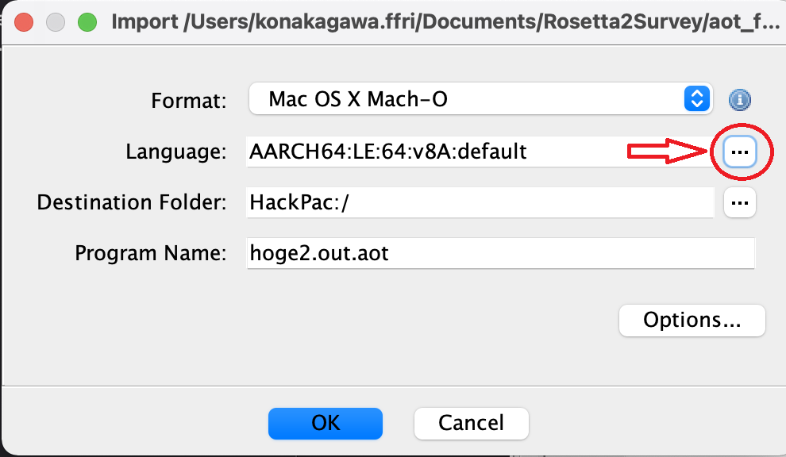
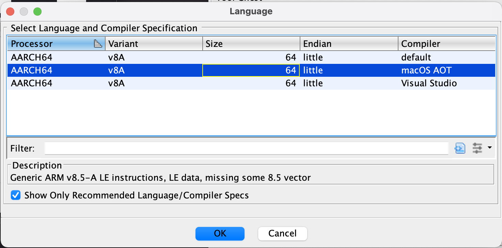

# Ghidra compiler specification (CSPEC) for AOT files 

## What's this?

The compiler specification (CPSEC) is one of the language modules used in Ghidra to support the disassembly and analysis of a particular processor. Its purpose is to describe the ABI of the compiler that generates binaries.

Since the decompilation result is based on the ABI described in the compiler specification, it will be poor if the appropriate CSPEC file is not selected.

Mach-O AOT files used in Rosetta 2 have its own ABI. Therefore, if you use the AArch64 ABI compiler specification to analyze an AOT binary, the decompilation results will be poor :(

This directory contains the compiler specification to properly decompile Mach-O AOT files.

## Usage

- Copy `AARCH64_aot.cspec` to `${GHIDRA_INSTALL_DIR}/Processors/AARCH64/data/languages`
- Open `${GHIDRA_INSTALL_DIR}/Processors/AARCH64/data/languages/AARCH64.ldefs` and add `<compiler name="macOS AOT" spec="AARCH64_aot.cspec" id="macOS_aot">`
- Restart Ghidra
- When opening a Mach-O AOT binary, select "Languages:" and choose "macOS AOT" (see the figures below)

## Tested

Ghidra 9.2.1 public

